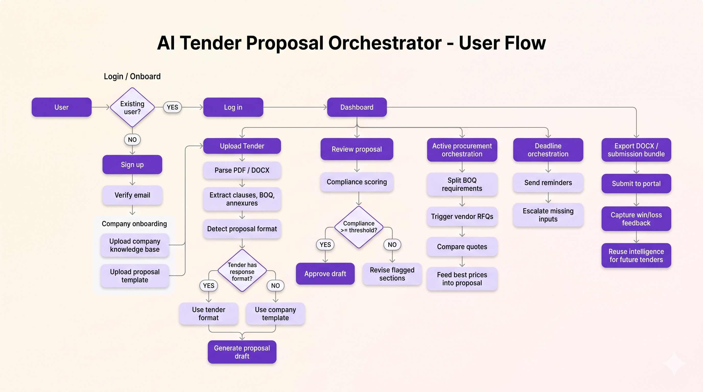
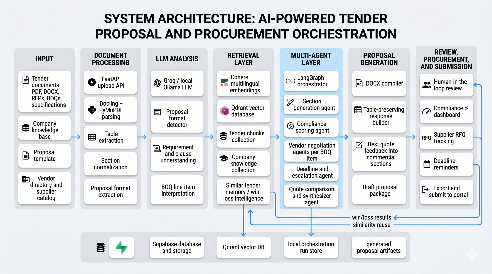
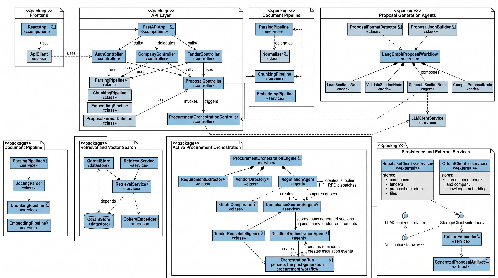
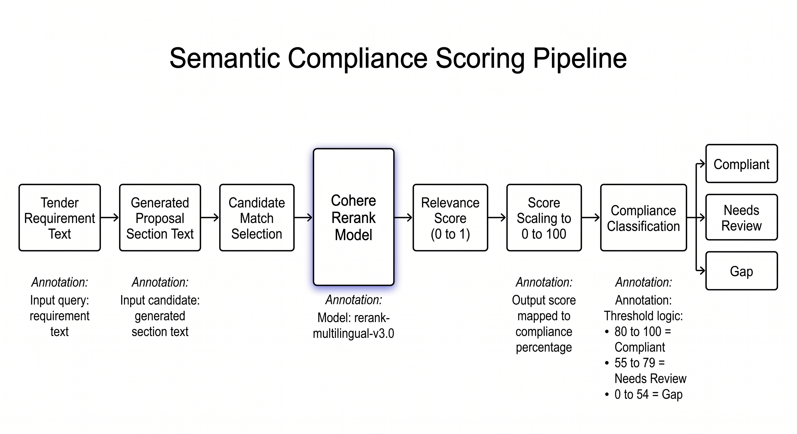

# TenderAI: Multi-Agent Tender Response & Procurement Orchestration 

TenderAI is a full-stack tender intelligence platform that parses tender documents, detects bidder-response formats, retrieves company knowledge, generates structured proposal drafts, and now continues the workflow into active procurement orchestration.

After proposal generation, the system can automatically derive supplier-facing requirements from tender sections and BOQ rows, send real RFQ emails to matched vendors, create pending quote records in Supabase, score proposal compliance using Cohere rerank semantic similarity, identify reusable knowledge from Qdrant, and persist orchestration runs in Supabase.

## Overview

The platform is designed to reduce the manual effort involved in responding to tenders that include:

- Long RFPs and technical specifications
- Annexures and bidder-fillable forms
- BOQ and commercial schedules
- Multi-section compliance tables
- Repetitive proposal drafting across similar tenders

Core capabilities:

- Company onboarding with knowledge base and proposal template upload
- Tender upload, parsing, section extraction, and proposal format detection
- Chunking, embedding, and retrieval over tender content and company knowledge
- LangGraph-based proposal generation in paragraph mode and table mode
- Active procurement orchestration after proposal generation
- Semantic compliance scoring before submission using Cohere rerank
- Similar tender reuse intelligence from Qdrant company knowledge matches
- Deadline-aware reminders and escalations
- React frontend workflow for onboarding, upload, processing, review, and export

## Solution Flow

1. A company user signs in or onboards through the frontend.
2. The system stores company metadata, the knowledge base, and the proposal template.
3. The knowledge base is parsed, chunked, embedded, and stored for retrieval.
4. A tender PDF is uploaded and parsed.
5. The backend detects whether the tender contains its own proposal response format.
6. The user generates a proposal using either the tender format or the onboarded company template.
7. LangGraph generates the proposal draft and compiles the final DOCX.
8. The procurement orchestration engine triggers automatically.
9. Vendor RFQs, compliance scores, reuse candidates, and deadline reminders become available for review.

## Visuals

### User Flow



### System Architecture



### UML Diagram



### Proposed Framework / Methodology


### LangGraph Workflow


### Procurement Orchestration Flow


### Compliance Scoring Pipeline



## Technology Stack

### Frontend

- React
- Vite
- JavaScript
- CSS
- Browser `localStorage`
- Fetch API

### Backend

- Python
- FastAPI
- Uvicorn
- LangGraph
- bcrypt
- python-docx
- ReportLab
- PyMuPDF
- Docling

### AI and Retrieval

- Groq
- Ollama via OpenAI-compatible API
- Cohere embeddings
- Qdrant vector database

### Storage

- Supabase database
- Supabase object storage

## Current Repository Structure

The README below reflects the current repository layout, not the older classroom-era structure.

```text
AutomatedProposalGeneration/
|-- api.py
|-- config.py
|-- graph.py
|-- retrieval.py
|-- requirements.txt
|-- README.md
|-- DIAGRAM_PROMPTS.md
|-- .env.example
|-- supabase_tender_metadata_migration.sql
|-- deployment/
|   |-- backend.Dockerfile
|   |-- frontend.Dockerfile
|   |-- docker-compose.yml
|   |-- nginx.conf
|   |-- .env.example
|   |-- README.md
|-- images/
|   |-- Userflow.png
|   |-- Sys_Arch.png
|   |-- UML.png
|   |-- Proposed Framework.png
|   |-- LangGraph Workflow Diagram.png
|   |-- Procurement Orchestration Flow.png
|   |-- Compliance.png
|-- agents/
|   |-- __init__.py
|   |-- graph.py
|   |-- state.py
|   |-- nodes/
|       |-- __init__.py
|       |-- load_sections_node.py
|       |-- process_section_node.py
|       |-- validate_section_node.py
|       |-- generate_section_node.py
|       |-- check_next_section_node.py
|       |-- compile_proposal_node.py
|       |-- test_node.py
|-- pipeline_one/
|   |-- __init__.py
|   |-- parsing.py
|   |-- chunking.py
|   |-- embedding.py
|   |-- parsing/
|   |   |-- __init__.py
|   |   |-- pipeline.py
|   |   |-- docling_parser.py
|   |   |-- normaliser.py
|   |   |-- models/
|   |       |-- __init__.py
|   |       |-- parsed_document.py
|   |-- chunking/
|   |   |-- __init__.py
|   |   |-- pipeline.py
|   |   |-- chunker.py
|   |   |-- section_walker.py
|   |   |-- metadata_builder.py
|   |   |-- language_detector.py
|   |   |-- models/
|   |       |-- __init__.py
|   |       |-- chunk_model.py
|   |-- embedding/
|   |   |-- __init__.py
|   |   |-- pipeline.py
|   |   |-- cohere_embedder.py
|   |   |-- qdrant_store.py
|   |-- retrieval/
|   |   |-- __init__.py
|   |   |-- retrieve_context.py
|   |-- proposal/
|       |-- __init__.py
|       |-- detector.py
|       |-- extractor.py
|       |-- json_builder.py
|       |-- llm_proposal_detector.py
|       |-- llm_format_validator.py
|-- procurement_orchestration/
|   |-- __init__.py
|   |-- engine.py
|-- frontend/
|   |-- index.html
|   |-- package.json
|   |-- package-lock.json
|   |-- .env.example
|   |-- README.md
|   |-- src/
|   |   |-- main.jsx
|   |   |-- api.js
|   |   |-- styles.css
|   |-- legacy-static/
|       |-- app.js
|       |-- dashboard.html
|       |-- export.html
|       |-- footer.html
|       |-- login.html
|       |-- main.html
|       |-- navigation.html
|       |-- processing.html
|       |-- proposal.html
|       |-- review.html
|       |-- styles.css
|       |-- supabase-config.js
|       |-- supabase_schema.sql
|       |-- upload.html
```

## Architecture by Module

### `api.py`

Main FastAPI application and primary backend entry point.

Responsibilities:

- Authentication
- Company onboarding
- Tender upload and processing
- Proposal generation
- Procurement orchestration trigger and retrieval

Important endpoints:

- `POST /login`
- `POST /onboard-company`
- `POST /upload-pdf`
- `POST /generate-proposal`
- `GET /check-proposal-format`
- `GET /procurement-orchestration/{doc_id}`
- `POST /trigger-procurement-orchestration`
- `POST /submit-quote`

### `config.py`

Central environment-based configuration shim used by agents and services.

### `agents/`

LangGraph proposal generation workflow.

Key files:

- `graph.py`: state machine construction and routing
- `state.py`: typed workflow state
- `nodes/load_sections_node.py`: loads sections or rows from `proposal_json`
- `nodes/process_section_node.py`: advances section processing
- `nodes/validate_section_node.py`: determines skip vs generate
- `nodes/generate_section_node.py`: retrieves context and generates text
- `nodes/check_next_section_node.py`: checks graph continuation
- `nodes/compile_proposal_node.py`: compiles the final DOCX

### `pipeline_one/parsing/`

Tender and template parsing pipeline.

Key files:

- `pipeline.py`: parse entry point
- `docling_parser.py`: Docling and PDF extraction logic
- `normaliser.py`: normalization into internal models
- `models/parsed_document.py`: parsed document schema

### `pipeline_one/chunking/`

Transforms parsed documents into retrieval-ready chunks.

Key files:

- `pipeline.py`
- `chunker.py`
- `section_walker.py`
- `metadata_builder.py`
- `language_detector.py`
- `models/chunk_model.py`

### `pipeline_one/embedding/`

Embeds chunks and stores them in Qdrant.

Key files:

- `pipeline.py`
- `cohere_embedder.py`
- `qdrant_store.py`

### `pipeline_one/retrieval/`

Semantic retrieval for proposal generation.

Key file:

- `retrieve_context.py`

### `pipeline_one/proposal/`

Proposal-format detection, extraction, and normalization.

Key files:

- `detector.py`
- `extractor.py`
- `json_builder.py`
- `llm_proposal_detector.py`
- `llm_format_validator.py`

### `procurement_orchestration/`

Post-generation active procurement engine.

Key file:

- `engine.py`

Responsibilities:

- Extract requirements from proposal sections and table rows
- Load vendors from Supabase with fallback defaults
- Send RFQ emails through SMTP
- Create pending vendor quote rows in Supabase
- Score compliance against tender requirements using Cohere rerank
- Build reusable knowledge suggestions from Qdrant `company_knowledge`
- Create reminder and escalation schedules
- Persist orchestration runs in Supabase

### `frontend/src/`

Current frontend SPA implementation.

Key files:

- `main.jsx`: route-level workflow UI and page composition
- `api.js`: backend API client
- `styles.css`: app styling

### `frontend/legacy-static/`

Older static prototype screens retained for reference only. They are not the active frontend runtime.

### `deployment/`

Containerized deployment starter for local server deployment and cloud VM deployment.

Key files:

- `backend.Dockerfile`: backend image definition
- `frontend.Dockerfile`: frontend build and Nginx image definition
- `docker-compose.yml`: orchestration for frontend and backend services
- `nginx.conf`: SPA serving and `/api` reverse proxy
- `.env.example`: deployment-time environment template
- `README.md`: deployment instructions

## Runtime Artifacts

These are referenced by the codebase but are generated at runtime rather than committed as durable source modules:

- files under `generated_proposals/`
- `uploaded_pdfs/`
- extracted proposal PDFs
- frontend build output under `frontend/dist/`

## Environment Variables

Create a backend `.env` file in the project root:

```env
SUPABASE_URL=your_supabase_project_url
SUPABASE_KEY=your_supabase_service_role_or_backend_key
COHERE_KEY=your_cohere_api_key
QDRANT_URL=your_qdrant_cluster_url
QDRANT_KEY=your_qdrant_api_key
GROQ_API_KEY=optional_if_used
SUPABASE_PROPOSAL_BUCKET=proposal-formats
SMTP_HOST=
SMTP_PORT=587
SMTP_USER=
SMTP_PASS=
```

Create a frontend `.env` file inside `frontend/`:

```env
VITE_BACKEND_BASE_URL=http://localhost:8000
VITE_GENERATE_PROPOSAL_BASE_URL=
VITE_LOGIN_ENDPOINT=/login
VITE_ONBOARD_COMPANY_ENDPOINT=/onboard-company
VITE_UPLOAD_PDF_ENDPOINT=/upload-pdf
VITE_GENERATE_PROPOSAL_ENDPOINT=/generate-proposal
VITE_CHECK_PROPOSAL_FORMAT_ENDPOINT=/check-proposal-format
VITE_PROCUREMENT_ORCHESTRATION_ENDPOINT=/procurement-orchestration
VITE_TRIGGER_PROCUREMENT_ORCHESTRATION_ENDPOINT=/trigger-procurement-orchestration
```

## Setup

### Backend

```powershell
python -m venv .venv
.\.venv\Scripts\Activate.ps1
pip install -r requirements.txt
uvicorn api:app --reload --host 0.0.0.0 --port 8000
```

Backend URL:

```text
http://localhost:8000
```

Swagger docs:

```text
http://localhost:8000/docs
```

### Frontend

```powershell
cd frontend
npm install
npm run dev
```

Frontend URL:

```text
http://localhost:5173
```

Production build:

```powershell
cd frontend
npm run build
```

Preview build:

```powershell
cd frontend
npm run preview
```

### Docker Deployment

The project now includes a ready-to-use deployment package under `deployment/`.

Quick start:

```powershell
cd deployment
copy .env.example .env
docker compose up --build -d
```

Default URLs:

```text
Frontend: http://localhost:8080
Backend:  http://localhost:8000
```

The frontend container serves the built SPA through Nginx and proxies `/api/*` traffic to the backend container.

## API Summary

### `POST /login`

Authenticates a company user.

### `POST /onboard-company`

Registers a company, uploads company documents, parses the knowledge base, and stores embeddings.

### `POST /upload-pdf`

Uploads a tender PDF, parses the document, detects the proposal format, chunks the content, stores embeddings, and persists tender metadata.

### `GET /check-proposal-format`

Returns whether the uploaded tender contains its own proposal format and whether tables were detected.

### `POST /generate-proposal`

Generates a uniquely named proposal DOCX under `generated_proposals/`, stores the generated file path in the `tenders` table, and automatically triggers procurement orchestration.

### `GET /procurement-orchestration/{doc_id}`

Returns the orchestration record for a tender.

The response includes:

- `multi_agent_negotiation`
- `compliance_scoring`
- `similarity_reuse_intelligence`
- `deadline_orchestration`

### `POST /trigger-procurement-orchestration`

Manually triggers orchestration for an existing tender.

### `POST /submit-quote`

Allows a vendor or integration service to update a pending row in `vendor_quotes` by `quote_id`.

## End-to-End Workflow

1. Start Supabase, Qdrant, and the LLM dependencies.
2. Start the FastAPI backend.
3. Start the Vite frontend.
4. Onboard a company with a knowledge base and template.
5. Upload a tender PDF.
6. Let the backend parse, chunk, embed, and detect proposal format.
7. Generate the proposal using either the tender format or the onboarded template.
8. Review the generated draft.
9. Inspect vendor RFQs, submitted quotes, compliance scores, reuse suggestions, and deadline alerts.
10. Export the proposal and prepare final submission.

## Supabase Expectations

The backend expects:

- A `companies` table
- A `tenders` table
- A `vendors` table
- A `vendor_quotes` table
- An `orchestration_runs` table
- A `company-documents` storage bucket
- A `tender-documents` storage bucket
- Optionally, a proposal-format storage bucket such as `proposal-formats`

Reference SQL is available in `frontend/legacy-static/supabase_schema.sql` and `supabase_tender_metadata_migration.sql`.

## Production Notes

- Move all secrets into environment variables and secret stores.
- Extend the SMTP RFQ flow with delivery tracking or webhook confirmations.
- Add vendor-facing authentication or signed quote submission links around `POST /submit-quote`.
- Add session auth and role-based access control.
- Restrict CORS to deployed frontend origins.
- Add file validation, malware scanning, and upload limits.
- Add audit logging and retry handling for long-running parsing and generation jobs.
- Version generated proposal artifacts instead of overwriting a single output file.
- For production deployment, place Supabase, Qdrant, SMTP, and LLM endpoints behind managed infrastructure and inject those endpoints through `deployment/.env`.

## Diagram Prompts

Gemini-ready prompts for user flow, system architecture, and UML diagrams are available in `DIAGRAM_PROMPTS.md`.

## Authors

Raman Gandewar  
Prathamesh Ghalsasi  
Divij Gujarathi
